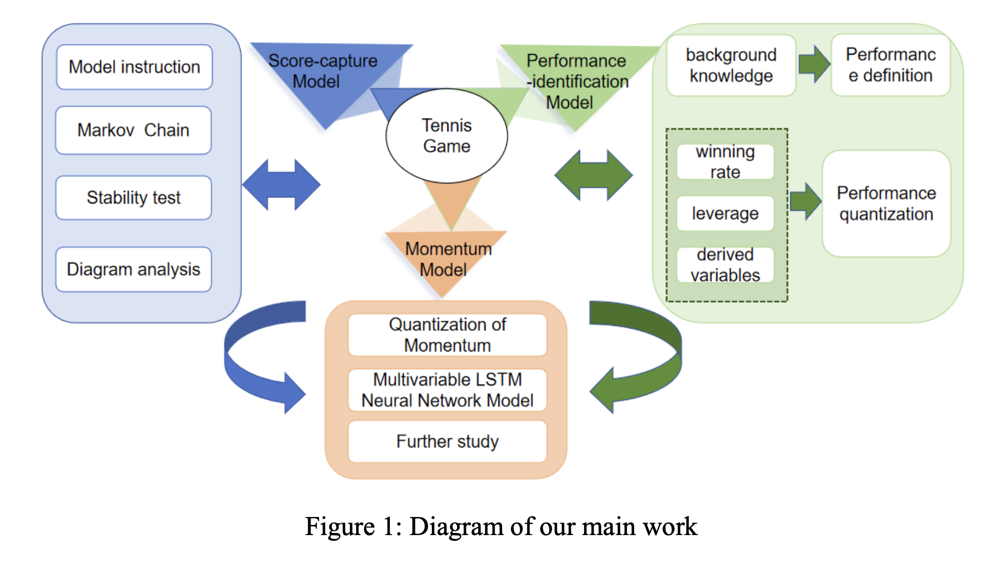
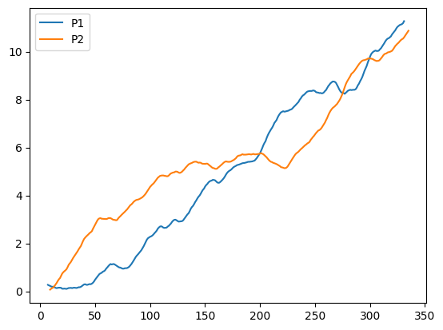
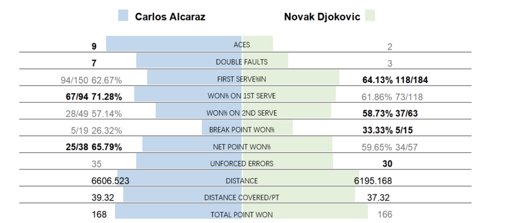
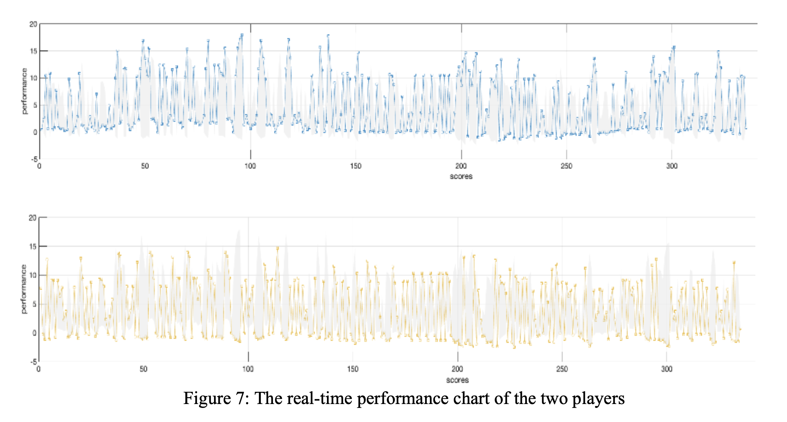

# 🎾 Tennis Match Outcome Prediction  

A machine learning and ensemble learning-based system for predicting professional tennis match outcomes.  

<!-- Banner -->
<div align="center">
  
</div>

<!-- Badges -->
<div align="center">
  
  
  
</div>

---

## 🗂️ Project Overview  

This project develops a predictive framework for professional tennis match outcomes by integrating multiple **ensemble learning** methods. Leveraging historical ATP and WTA match records, we perform **feature engineering** to construct player performance metrics, surface-adjusted statistics, and fatigue indices. We then train an ensemble of models to produce robust predictions across different tournament types and playing surfaces.

**Core Objectives:**
- 📊 Acquire and preprocess data from ATP/WTA databases  
- 🏟️ Engineer features including surface-adjusted statistics and fatigue metrics  
- 🤖 Train models using Gradient Boosting, Random Forest, and Logistic Regression  
- 🧠 Apply soft voting ensemble for prediction stability  
- 📈 Evaluate models and interpret feature importance using SHAP  

---

## 📦 Installation  

```bash
git clone https://github.com/Yingurt001/Tennis-Match-Prediction.git
cd Tennis-Match-Prediction
pip install -r requirements.txt
```
## 🎯 Dataset Description  

### 📌 Data Sources  
- **ATP/WTA Official Match Records** – Includes player names, ATP/WTA rankings, match dates, tournament types, court surfaces, and detailed match statistics.  
- **Coverage** – Grand Slam events, Masters 1000 tournaments, ATP/WTA Tour matches.  

### 🔑 Key Features  
- 🎯 **Serve performance metrics** – First serve percentage, number of aces, and double faults.  
- 🛡️ **Return performance indicators** – Break point conversion rate, return points won.  
- 🏃 **Fatigue index** – Computed from consecutive matches, travel distances, and tournament stage.  
- 🏟️ **Surface-adjusted win rates** – Adjusted for differences in performance on hard, clay, and grass surfaces.  

---

## ⚙️ Methodology  

### 1️⃣ Data Preprocessing  
- Remove incomplete match records and unify categorical formats.  
- Encode court surface, tournament type, and player identifiers.  
- Handle missing numerical statistics using median imputation.  

### 2️⃣ Feature Engineering  
- Calculate **surface-adjusted statistics** to account for performance variations by surface type.  
- Construct a **fatigue index** incorporating rest days, travel burden, and cumulative match load.  

### 3️⃣ Modeling  
- Train base models:  
  - Gradient Boosting (XGBoost / LightGBM)  
  - Random Forest Classifier  
  - Logistic Regression  
- Combine model predictions using **soft voting ensemble** for improved stability.  

### 4️⃣ Evaluation  
- Apply **nested cross-validation** for unbiased model performance estimation.  
- Metrics used: **ROC-AUC**, accuracy, precision, recall.  
- Analyze **feature importance** using SHAP values for interpretability.  

---

## 📊 Results  

<p align="center">
  
</p>

<p align="center">
  
</p>
<p align="center">
  
</p>


---

## 👨‍💻 Project Maintainers  

Thanks to these contributors:  

<table>
  <tr>
    <td align="center">
      <a href="https://github.com/Yingurt001">
        
        <br />
        <sub><b>Ying Zhang</b></sub>
      </a>
    </td>
    <td align="center">
      <a href="https://github.com/Alex-TtTT">
        
        <br />
        <sub><b>Alex Hua</b></sub>
      </a>
    </td>
    <td align="center">
      <a href="https://github.com/Lychee-1013z">
        
        <br />
        <sub><b>Yuzhi Zheng</b></sub>
      </a>
    </td>
  </tr>
</table>

**Authors:** Ying Zhang, [Co-Author 1], [Co-Author 2]  
**GitHub:** @Yingurt001, @[CoAuthor1], @[CoAuthor2]  
**Email:** your_email@example.com, coauthor1@example.com, coauthor2@example.com  

---

## 🎓 Citation  

If you use this work, please cite:  
> Zhang, Y., [CoAuthor1], [CoAuthor2]. *Tennis Match Outcome Prediction via Ensemble Learning*. 2024.  

---

<div align="center">
  <b>⭐ If you find this project useful, please consider giving it a star!</b>  
  <br>  
  <em>From historical match data to accurate victory predictions — smarter tennis analytics for the modern game.</em>
</div>


